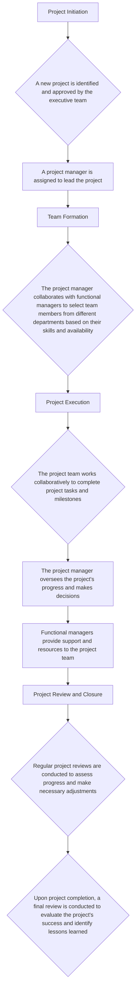

AICORP : Functional-Project Matrix

This hybrid structure combines the stability and efficiency of a functional structure with the flexibility and focus of a project-based structure. While there's no direct dual reporting, project managers report to functional managers, ensuring alignment with the organization's overall strategy.

Key Characteristics:

- Strong Functional Departments: Well-defined functional departments (e.g., engineering, marketing, finance) maintain core competencies and provide support to projects.

- Project-Based Teams: **Cross-functional teams** are formed for specific projects, drawing talent from different departments.

- Functional Manager Oversight: **Functional managers oversee both the day-to-day operations** of their departments and the performance of team members on projects.

- Project Manager Leadership: Project managers lead project teams, define project goals, and track progress.

- Minimal Meetings, Maximum Efficiency: A lean approach to meetings, focusing on key decision points and progress reviews.

- Written Communication: Clear and concise written communication, including project plans, status reports, and design documents.

Key Departments:

    Product Engineering:        
        Software Engineers
        QA Testers
        DevOps Engineers
        Product Managers
        Product Owners

    Design:
    
        UX/UI Designers
        Graphic Designers
        Content Creators

    Marketing:
        Marketing Managers
        Social Media Specialists

    Sales:
        Sales Representatives
        Sales Managers
        Account Executives

    Operations:
        HR
        Finance
        Facilities

# Organizational Structure:
 
How it Works:

Benefits of This Hybrid Structure:

    Clear Roles and Responsibilities: Well-defined roles for functional managers and project managers.
    Efficient Resource Allocation: Optimal allocation of resources to projects.
    Enhanced Collaboration: Cross-functional teams foster innovation and creativity.
    Reduced Bureaucracy: Minimal meetings and reliance on written communication.
    Improved Focus: Clear project objectives and timelines.

By implementing this hybrid structure, organizations can balance the need for functional expertise with the demands of specific projects, leading to increased efficiency, innovation, and overall organizational success.
